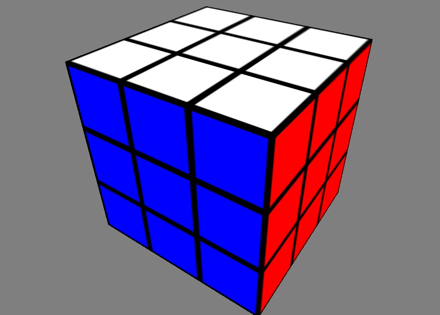

# Two-Phase Rubik's Cube Solving Algorithm using Python

## Description

Rubik's Cube modelisation in Python using OpenGL for the 3D rendering and animation. This work was inspired by Herbert Kociembia, the method implemented is explained in his [Cube Explorer](http://kociemba.org/cube.htm) project.

Detailed informations about my own implementation are written in french below.



## Setup

Runs on Python 3.7, a config file is provided to create the Conda environment using the following command:

``` bash
conda env create -f cuber-env.yaml
```

Alternatively, you can install the dependencies using pip:

``` bash
python -m pip install requirements.txt
```

To run the program, performing a single scramble and solve, simply run:

``` bash
python main.py
```

## Conventions pour la modélisation du Rubik's Cube

### Général

Pour un cube résolu on associe les faces à une unique couleur, qui est
celle du centre (dont la position ne change jamais), comme décrit ci-dessous :

+ U : Blanc  (W)
+ D : Jaune  (Y)
+ R : Orange (O)
+ F : Bleu   (B)
+ L : Rouge  (R)
+ B : Vert   (G)

De plus l'ordre d'énumération des faces sera toujours celui décrit ci-dessus.

Chaque mouvement est décrit par la face qui est concernée (U,D,...,B) et par
sa force :

+ 0 : Quart de tour dans le sens horaire
+ 1 : Quart de tour dans le sens anti-horaire
+ 2 : Demi-tour

Cela resulte en 18 mouvements différents.

### Cube à facettes

Pour chaque face, on associe une liste de facettes [U0,U1,...,U8]

On peut ainsi représenter le patron du cube :

``` text
                |----|----|----|
                | U0 | U1 | U2 |
                |----|----|----|
                | U3 | U4 | U5 |
                |----|----|----|
                | U6 | U7 | U8 |
                |----|----|----|
|----|----|----||----|----|----||----|----|----||----|----|----|
| L0 | L1 | L2 || F0 | F1 | F2 || R0 | R1 | R2 || B0 | B1 | B2 |
|----|----|----||----|----|----||----|----|----||----|----|----|
| L3 | L4 | L5 || F3 | F4 | F5 || R3 | R4 | R5 || B3 | B4 | B5 |
|----|----|----||----|----|----||----|----|----||----|----|----|
| L6 | L7 | L8 || F6 | F7 | F8 || R6 | R7 | R8 || B6 | B7 | B8 |
|----|----|----||----|----|----||----|----|----||----|----|----|
                |----|----|----|
                | D0 | D1 | D2 |
                |----|----|----|
                | D3 | D4 | D5 |
                |----|----|----|
                | D6 | D7 | D8 |
                |----|----|----|
```

``` text
                        Blanc.Face[1]
                                |
                                V
                    |----|----|----|
  Blanc.Face[0] =>  | U0 | U1 | U2 |
                    |----|----|----|
                    | U3 | U4 | U5 |
                    |----|----|----|
                    | U6 | U7 | U8 |    <= Blanc.Face[2]
                    |----|----|----|
                      /\
                       |
                Blanc.Face[3]
```
